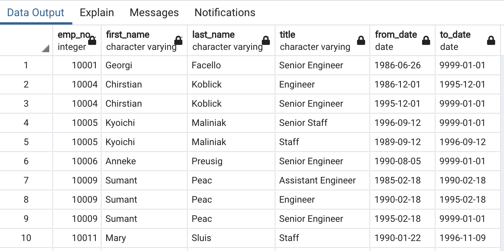

# Pewlett-Hackard-Analysis

Overview of the analysis: 

The purpose of this analysis was to determine the number of retiring employees for the various roles and also to identify the  employees eligible to participate in a mentorship program for the Pewlett-Hackard company. Postgress SQL was used for the analysis.  Six tables were used for the analysis and an Entity Relation Diagram (ERD) which maped out the various tables and their connections through primary and reference keys.

Results: 
1. The first analysis involved identifying  the retiring employees by their title. Some employees had multiple titles over the period.

--Retirement Titles:
SELECT e.emp_no,
e.first_name,
e.last_name,
ti.title,
ti.from_date,
ti.to_date
INTO retirement_titles
FROM employees AS e
INNER JOIN titles AS ti
ON (e.emp_no = ti.emp_no)
WHERE (e.birth_date BETWEEN '1952-01-01' AND '1955-12-31')
ORDER BY e.emp_no;

2. Then went on to determined the total number of  retiring employees grouped by title and removed duplicate rows.

-- Use Dictinct with Orderby to remove duplicate rows:
SELECT DISTINCT ON (emp_no) emp_no,
first_name,
last_name,
title
INTO unique_titles
FROM retirement_titles 
WHERE to_date = '9999-01-01'
ORDER BY emp_no, to_date DESC;

3. There after accounted for the number of retiring employees by the most recent job title and grouped by title.

-- The number of employees by their most recent job title who are about to retire:
SELECT COUNT(title) AS count,  title
INTO retiring_titles
FROM unique_titles
GROUP BY title
ORDER BY count DESC;

4. Finaly, I Identified the employees eligible for participation in the mentorship program.

-- the employees who are eligible to participate in a mentorship program:
SELECT DISTINCT ON (e.emp_no) e.emp_no,
e.first_name,
e.last_name,
e.birth_date,
de.from_date,
de.to_date,
ti.title
INTO mentorship_eligibility
FROM employees AS e
INNER JOIN dept_emp AS de
ON (e.emp_no = de.emp_no)
INNER JOIN titles AS ti
ON (e.emp_no = ti.emp_no)
WHERE (e.birth_date BETWEEN '1965-01-01' AND '1965-12-31')
AND (de.to_date = '9999-01-01')
ORDER BY emp_no;

Summary: Provide high-level responses to the following questions, then provide two additional queries or tables that may provide more insight into the upcoming "silver tsunami."
How many roles will need to be filled as the "silver tsunami" begins to make an impact?
A new query to include the various departments for the distinct employees whose roles will need to be filled during the "silver tsunami. There are over 90,000 roles to be filled across board.

Are there enough qualified, retirement-ready employees in the departments to mentor the next generation of Pewlett Hackard employees?
Unfortunately, there are only 1549 qualified mentees in the departments for the next generation which would not be adequate.
SQL query used: SELECT COUNT (emp_no) AS count  from  mentorship_eligibility;
